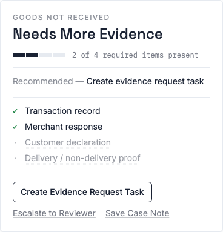
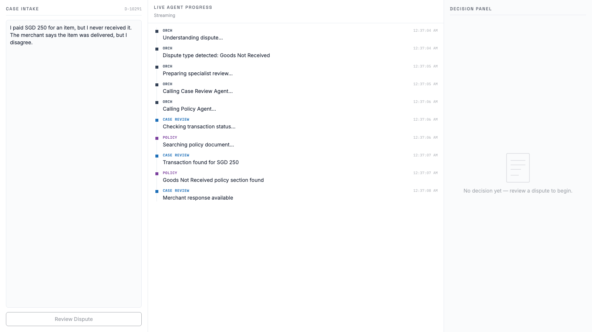
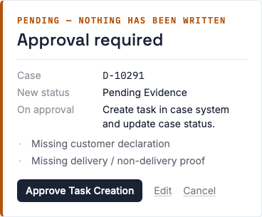
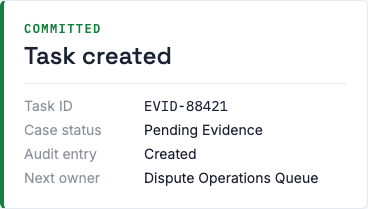

# agentic-dispute-workbench-ui

[](https://github.com/sivabalaji1986/agentic-dispute-workbench-ui/actions/workflows/ci.yml)
[](LICENSE)

## What this is

Dispute ops today means an analyst alt-tabbing between a case system, a policy PDF, and
a spreadsheet, then writing up a decision from memory. This is the frontend half of a
system built to fix that: an ops analyst submits a customer dispute, watches two
specialist agents (case review, policy) work it in parallel with full visibility into
what each one is doing, and reviews a structured decision — not a chat reply — before
approving the one write action that actually changes anything. Nothing is written to
the case system without an explicit human approval on a screen that says, in as many
words, "nothing has been written yet."

This repo is the frontend only — the AG-UI client and A2UI renderer host. The backend
(`agentic-dispute-workbench-platform`, Java/Spring) does not exist yet; it implements the
wire contract this README summarizes and
[`docs/superpowers/specs/2026-07-13-agentic-dispute-workbench-ui-design.md`](docs/superpowers/specs/2026-07-13-agentic-dispute-workbench-ui-design.md)
documents in full. Until it exists, this repo is fully buildable, runnable, and demoable
standalone via a scripted mock mode — see [Running it](#running-it).

## The protocols, and where you see each one

Two protocols are visible in this UI; two more happen entirely behind it.

**AG-UI is the live timeline.** Every line in the center panel — "Understanding
dispute...", "Checking transaction status...", the CASE REVIEW / POLICY / ORCH tags — is
one AG-UI event arriving over an SSE stream. This app _is_ the AG-UI client: it holds no
agent logic of its own, just an `HttpAgent` (or, in mock mode, a script-replaying stand-in
with the same shape) subscribed to that stream, turning each event into one ledger row in
arrival order. Two AG-UI event types carry the whole timeline: `CUSTOM` events named
`"progress"` for every line you see, and `STATE_SNAPSHOT`/`STATE_DELTA` for the small
evidence-readiness chip in the timeline header.

**A2UI is the decision panel.** Once the agents finish, the backend doesn't send text to
render — it sends a declarative JSON component tree, and this app renders it through a
closed, five-component catalog (below). The backend can only ever ask for one of those
five; anything else renders as a visible fallback box, never a crash. Concretely, this
JSON —

```json
[
  {
    "id": "root",
    "component": "DecisionCard",
    "status": "Needs More Evidence",
    "disputeType": "Goods Not Received",
    "evidenceReadiness": "2 of 4 required items present",
    "recommendedAction": "Create evidence request task",
    "checklistId": "evidence-checklist",
    "actionsId": "next-actions"
  },
  {
    "id": "evidence-checklist",
    "component": "EvidenceChecklist",
    "items": [
      { "label": "Transaction record", "present": true },
      { "label": "Merchant response", "present": true },
      { "label": "Customer declaration", "present": false },
      { "label": "Delivery / non-delivery proof", "present": false }
    ]
  },
  {
    "id": "next-actions",
    "component": "NextActions",
    "actions": [
      { "id": "create_evidence_request_task", "label": "Create Evidence Request Task" },
      { "id": "escalate_to_reviewer", "label": "Escalate to Reviewer" },
      { "id": "save_case_note", "label": "Save Case Note" }
    ]
  }
]
```

— becomes this:



Three flat, sibling entries in one `updateComponents` call — never nested objects.
`DecisionCard` is the surface root and composes the other two by id
(`checklistId`/`actionsId`) using A2UI's own `buildChild` mechanism. See
[Contract notes](#contract-notes-for-backend-implementers) for why this shape is frozen.

**A2A and MCP happen entirely backend-side — this frontend has no awareness of either.**
A2A is the protocol the orchestrator uses to delegate to the Case Review and Policy
specialist agents; MCP is how it calls the case system during the write phase — both by
design, per the platform spec. From here, both are visible only as _effects_: the CASE
REVIEW and POLICY lines interleaving on the timeline are what an A2A fan-out looks like
from the outside, and the plain-language progress lines during approval ("Creating
evidence request task...", "Creating audit entry...") are a business-readable narration
of the orchestrator's MCP tool calls, not a rendering of the calls themselves. This
frontend intentionally has no MCP client, no A2A client, and no data model for either —
if a future requirement needs one, that's new scope, not something implied by what's
here.

## The flow

Eight steps, each naming which AG-UI run it happens in — session and run mechanics are
in the [next section](#session-and-surface-model).

1. **Submit** — click _Review Dispute_. The **review run** starts on a fresh `threadId`.
2. **Classify** — Orchestrator: "Understanding dispute...", "Dispute type detected:
   Goods Not Received."
3. **Parallel fan-out** — Orchestrator hands off: "Calling Case Review Agent...",
   "Calling Policy Agent..."
4. **Interleaved progress** — Case Review and Policy Agent lines arrive interleaved, in
   true arrival order, on the same timeline.
   <br />
5. **Merge** — Orchestrator reconciles case facts against policy requirements and
   computes evidence readiness (the review run's `STATE_SNAPSHOT`/`STATE_DELTA`).
6. **Decision UI** — the review run's `updateComponents` renders `DecisionCard` +
   `EvidenceChecklist` + `NextActions`; `RUN_FINISHED`.
7. **Approval preview** — click _Create Evidence Request Task_. A **preview run** starts
   on the _same_ `threadId` and renders `ApprovalPreview` — the gate, amber, "nothing
   has been written yet."
   <br />
8. **Committed write** — click _Approve Task Creation_. An **approval run** starts on the
   same `threadId`, streams the write-phase progress lines, and renders
   `TaskCreatedCard`.
   <br />

```
threadId: thread-D-10291-<ts>   (reused for every run below)
│
├─ review run    RUN_STARTED → progress ×N → updateComponents(DecisionCard, …) → RUN_FINISHED
│                                              ⤷ createSurface happens here, once
│
├─ preview run   RUN_STARTED → updateComponents(ApprovalPreview)               → RUN_FINISHED
│                                              ⤷ same surface, updated in place
│
└─ approval run  RUN_STARTED → progress ×4 → updateComponents(TaskCreatedCard)  → RUN_FINISHED
                                               ⤷ same surface, updated in place
```

## Session and surface model

Plain-English summary of design doc §3.3/§3.5 — read those sections for the normative
version:

- **One `threadId` per case session**, reused across every run in that session (review,
  preview, approval, and an alternate cancel run) — not one `threadId` per run. AG-UI SSE
  is server→client only, so every button click necessarily starts a _new_ run; `threadId`
  is what tells the backend these runs belong to the same case.
- **One persistent A2UI surface.** `createSurface` fires once, on whichever run first has
  UI to show. Every later run in the session updates that surface in place
  (`updateComponents`) — none of them delete and recreate it.
- **Pending-approval state is server-owned**, keyed by `(threadId, surfaceId)`. The
  client never tracks "is this case awaiting approval" itself — it just renders whatever
  the backend's next `updateComponents` says.
- **Actions travel as new runs.** A button click becomes
  `agent.runAgent({ forwardedProps: { a2uiAction: <the clicked action> } })` on the same
  `threadId` — there is no separate action-only transport.

## Running it

Mock mode is the default and needs no backend:

```bash
npm install
npm run dev
```

Open the printed local URL and walk through [the flow](#the-flow) above. What each of
the three `NextActions` buttons does in mock mode:

| Button                           | Mock behavior                                                                                                      |
| -------------------------------- | ------------------------------------------------------------------------------------------------------------------ |
| **Create Evidence Request Task** | Starts the preview run → `ApprovalPreview`.                                                                        |
| **Escalate to Reviewer**         | Client-side toast, _"Escalate to Reviewer is not in demo scope."_ No run starts, timeline is untouched. Not a bug. |
| **Save Case Note**               | Same as above: _"Save Case Note is not in demo scope."_ No run starts.                                             |

On `ApprovalPreview`: **Approve Task Creation** starts the approval run; **Cancel**
starts a real cancel run that reverts the surface to the decision view (per §3.4.1 —
cancel is server-driven, not a client-side revert); **Edit** shows a client-only toast,
_"Edit flow not in demo scope,"_ and never starts a run.

### Pointing at a real backend

Copy `.env.example` to `.env`:

```
VITE_MOCK=false
VITE_ORCHESTRATOR_URL=http://localhost:8080/agui
```

No code changes — `src/agui/client.ts` picks between the mock engine and a real
`HttpAgent` pointed at `VITE_ORCHESTRATOR_URL` based on `VITE_MOCK` alone.

## Catalog reference

Closed catalog (id `https://dispute-workbench.internal/catalogs/v1.json`) — exactly
these five components. Anything else the backend sends renders as a visible
`UnknownComponentFallback` box (original type name + pretty-printed raw JSON), never a
crash — the catalog is closed by construction, not by convention.

| Component           | Props                                                                                                                                          | Notes                                                                                                                                                                                  |
| ------------------- | ---------------------------------------------------------------------------------------------------------------------------------------------- | -------------------------------------------------------------------------------------------------------------------------------------------------------------------------------------- |
| `DecisionCard`      | `status`, `disputeType`, `evidenceReadiness`, `recommendedAction` (dynamic strings); `checklistId`, `actionsId` (optional component ids)       | Always the surface root; composes `EvidenceChecklist`/`NextActions` via `buildChild` — see above.                                                                                      |
| `EvidenceChecklist` | `items: { label: string, present: boolean }[]`                                                                                                 |                                                                                                                                                                                        |
| `NextActions`       | `actions: { id: string, label: string }[]`                                                                                                     | Dispatches an action named after the clicked item's `id` — **except** `escalate_to_reviewer` and `save_case_note`, which the client always intercepts (see [Running it](#running-it)). |
| `ApprovalPreview`   | `caseId`, `newCaseStatus`, `actionAfterApproval` (dynamic strings); `missingItems: string[]`; `onApprove`, `onEdit`, `onCancel` (A2UI actions) | The approval gate. `onEdit` is intercepted client-side (never dispatched); `onApprove`/`onCancel` are real actions.                                                                    |
| `TaskCreatedCard`   | `taskId`, `caseStatus`, `auditEntry`, `nextOwner` (dynamic strings)                                                                            | Terminal success state.                                                                                                                                                                |

## Contract notes for backend implementers

These are `[convention — frozen]` in the design doc — treat them as load-bearing, not
suggestions. One-line rationale each; the doc is the authority if anything here is
ambiguous.

- **Progress lines and A2UI payloads both ride AG-UI `CUSTOM` events**
  (`name: "progress"` / `name: "a2ui"`), never `TEXT_MESSAGE_*`. _Why:_ typed
  `ag-ui-core` Java classes have no passthrough-field mechanism; `CUSTOM.value` is
  untyped by design, so routing both through it means solving "serialize an arbitrary
  payload" once, not twice.
- **`updateComponents` entries are always flat siblings**, cross-referenced by id
  (`checklistId`/`actionsId`), never inlined/nested child objects. _Why:_ matches
  A2UI's real wire shape and keeps `DecisionCard`'s composition mechanism (`buildChild`)
  working without a bespoke nesting format.
- **`createSurface` fires once per session**; the client ignores a duplicate for an
  existing `surfaceId` rather than erroring or recreating it.
- **`evidenceReadiness` is two independent channels** — AG-UI state
  (`STATE_SNAPSHOT`/`STATE_DELTA`, drives the timeline chip) and an A2UI `DecisionCard`
  prop (`updateComponents`). Update both on change; neither is derived from the other.
- **Two `NextActions` ids never reach the backend**: `escalate_to_reviewer` and
  `save_case_note` are valid ids the backend may send, but the client intercepts them
  before dispatch. Don't build a handler for them — build the toast expectation instead.
- **Cancel is a real, server-driven run** (§3.4.1), not a client-side revert — the
  backend must respond to a `cancel_task_creation` action with an `updateComponents` that
  restores the decision view.
- **Action ids are allow-listed.** The client only ever dispatches
  `create_evidence_request_task`, `approve_task_creation`,
  `cancel_task_creation`, `escalate_to_reviewer`, or `save_case_note` from
  `NextActions`. An action id outside that list renders disabled and never
  reaches the backend — adding a new action id means updating
  `src/agui/actionIds.ts` and the design doc, not just the payload.

**Versions:** A2UI spec pinned to **v0.9** (spec is evolving; do not assume forward
compatibility with v1.0) — `@a2ui/react@0.10.1` / `@a2ui/web_core@0.10.4`.
`@ag-ui/client`/`@ag-ui/core@0.0.57`. All dependency versions in `package.json` are
pinned exact, not range-matched.

**Captured-stream contract fixtures:** `src/test/fixtures/` holds one AG-UI event
per line (NDJSON), replayed in `src/test/fixtures/contract.test.ts` through the
same bridge/validation code path the live and mock agents use — a
cross-language contract test for the future Java backend. The four
`*-success.ndjson` fixtures are generated from `src/mock/demoScript.ts` via
`npm run fixtures:regen`; see `src/test/fixtures/README.md` for the rest.

## Development

```bash
npm run dev          # start the dev server (mock mode by default)
npm run build         # typecheck + production build
npm run test           # run the test suite once
npm run test:watch   # watch mode
npm run lint           # ESLint
npm run format         # Prettier, write mode
npm run typecheck     # tsc -b --noEmit
```
